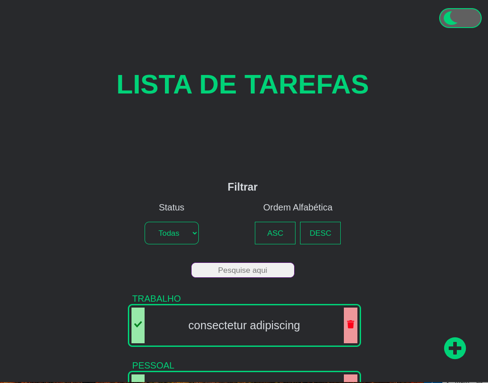

# React To-Do App

[Português]
Um aplicativo simples e eficiente de lista de tarefas construído com React, Tailwind CSS, Node.js e MongoDB para ajudá-lo a organizar suas tarefas diárias.

[English]
A simple and efficient to-do list application built with React, Tailwind CSS, Node.js, and MongoDB to help you organize your daily tasks.

## Live Demo
[Português]
Confira a demonstração ao vivo:

[English]
Check out the live demo: 

[Live Preview](https://to-do-app-frontend-amn0.onrender.com/)

## Screenshot

## Features
[Português]
- Adicionar, editar e excluir tarefas
- Marcar tarefas como concluídas
- Filtrar tarefas
- Design responsivo para dispositivos móveis e desktop

[English]
- Add, edit, and delete tasks
- Mark tasks as completed
- Filter tasks
- Responsive design for mobile and desktop

## Technology Stacks
- React
- Tailwind CSS
- Node.js
- MongoDB

## Author
Created by Jessica Bandeira.
- LinkedIn: [Jessica's LinkedIn Profile](https://www.linkedin.com/in/jessica-santosb/)

## Known Issues and Future Improvements
[Português]
- Mencione quaisquer problemas conhecidos ou limitações.
- Esboce seus planos para melhorias futuras.

[English]
- Mention any known issues or limitations.
- Outline your plans for future improvements.
